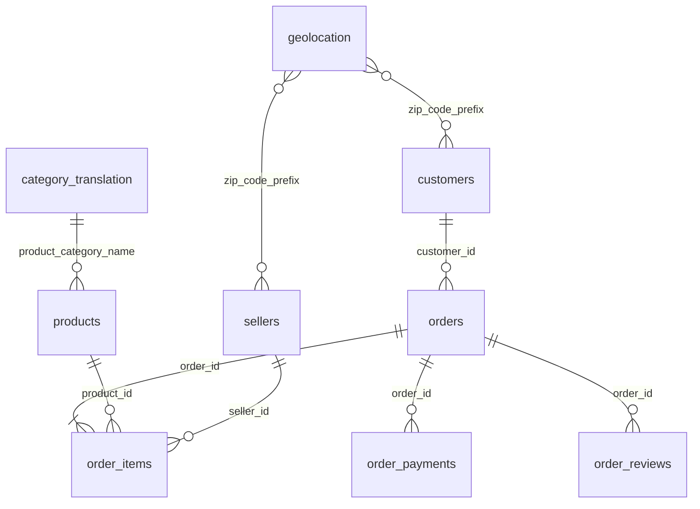
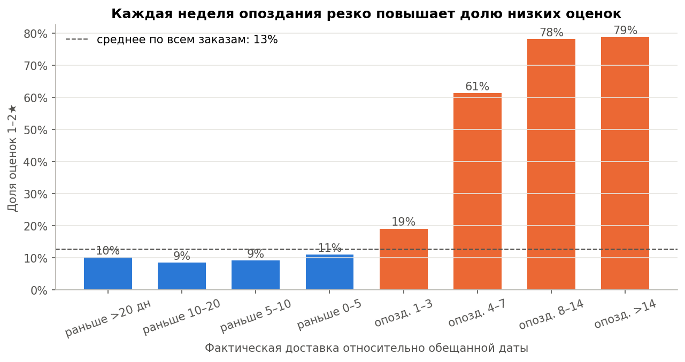
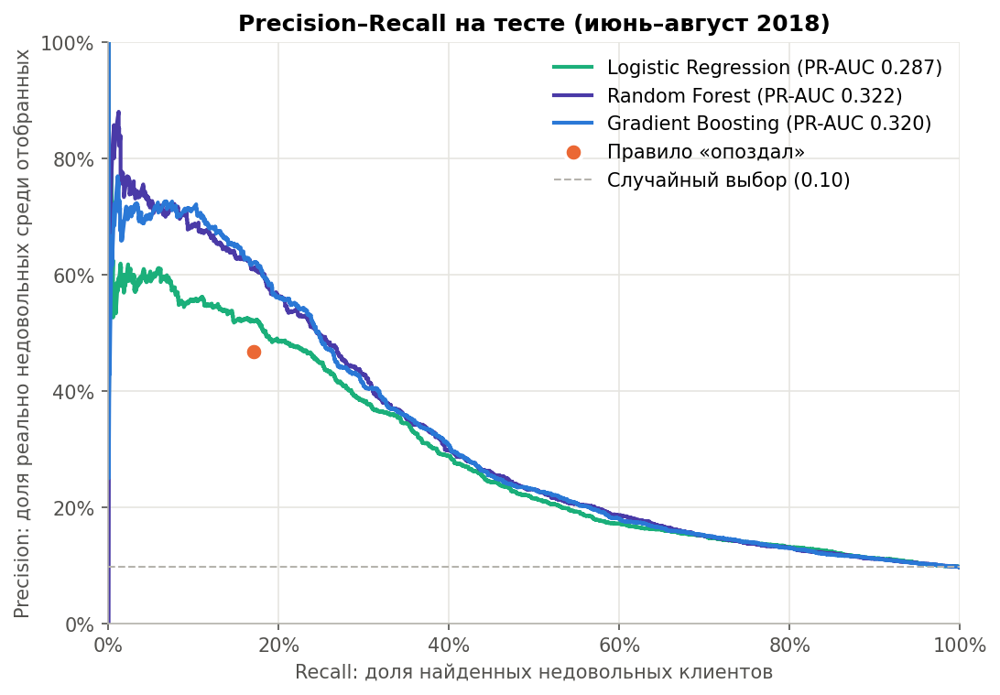
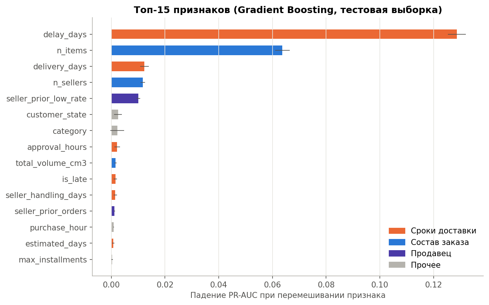

# Прогноз недовольства клиента маркетплейса Olist

Финальный проект курса по Data Science (Capstone Project).

**Бизнес-вопрос:** можно ли предсказать, что клиент поставит низкую оценку (1–2★), ещё **до** того, как он её оставил,
используя только данные, известные в момент доставки заказа (товар, сумма, оплата, продавец, сроки доставки)?

**Короткий ответ:** да, частично. Модель градиентного бустинга выделяет 10% самых рискованных заказов, среди которых **35%** клиентов действительно ставят 1–2★
(в 3,6 раза чаще среднего). Эта группа покрывает **36%** всех недовольных клиентов — **вдвое больше**, чем простое правило «заказ опоздал».
Главный драйвер недовольства — **нарушенный срок доставки**, второй — **сложность заказа** (несколько товаров и продавцов).

---

## Содержание
- [Данные](#данные)
- [Структура репозитория](#структура-репозитория)
- [Как запустить](#как-запустить)
- [Методология](#методология)
- [Результаты](#результаты)
- [Бизнес-выводы и рекомендации](#бизнес-выводы-и-рекомендации)
- [Ограничения](#ограничения)
- [Технологии](#технологии)

## Данные

[Brazilian E-Commerce Public Dataset by Olist](https://www.kaggle.com/datasets/olistbr/brazilian-ecommerce): реальные анонимизированные данные
о ~100 тыс. заказов 2016–2018 гг., 9 связанных CSV-таблиц.



> Датасет **не хранится** в репозитории (≈ 120 МБ CSV + 180 МБ базы). Файлы данных исключены через `.gitignore`; как их получить — ниже.

## Структура репозитория

```
olist-capstone/
├── data/
│   ├── raw/                  # сюда кладутся 9 CSV с Kaggle (в git не попадают)
│   └── olist.db              # SQLite-база, создаётся скриптом (в git не попадает)
├── notebooks/
│   ├── 01_database_sql.ipynb # схема БД, загрузка, SQL-запросы с JOIN, сборка признаков
│   ├── 02_eda.ipynb          # EDA, пропуски, подготовка целевой переменной
│   └── 03_modeling.ipynb     # модели, метрики, выбор порога, интерпретация
├── sql/
│   ├── 01_schema.sql         # DDL: таблицы, первичные и внешние ключи, индексы
│   ├── 02_feature_tables.sql # агрегаты уровня заказа (JOIN, GROUP BY, оконные функции)
│   └── 03_feature_mart.sql   # итоговая витрина признаков order_features
├── src/
│   └── build_database.py     # загрузка CSV в SQLite + запуск SQL-скриптов признаков
├── reports/figures/          # все графики из ноутбуков
├── presentation/             # слайды для защиты
├── requirements.txt
└── README.md
```

## Как запустить

```bash
# 1. Клонировать репозиторий и установить зависимости (Python 3.10+)
git clone <url-репозитория>
cd olist-capstone
python -m venv .venv
source .venv/bin/activate          # Windows: .venv\Scripts\activate
pip install -r requirements.txt

# 2. Скачать датасет с Kaggle и распаковать 9 CSV в data/raw/
#    вручную: https://www.kaggle.com/datasets/olistbr/brazilian-ecommerce  -> Download
#    или через Kaggle API:
kaggle datasets download -d olistbr/brazilian-ecommerce -p data/raw --unzip

# 3. Запустить ноутбуки по порядку (01 создаёт базу data/olist.db)
jupyter notebook notebooks/
```

Полный прогон занимает ~15 минут, большая часть уходит на кросс-валидацию Random Forest в ноутбуке 03.
Базу можно собрать и без Jupyter: `python src/build_database.py`.

## Методология

### 1. База данных и SQL
* Все 9 таблиц загружены в **SQLite** со схемой из первичных и внешних ключей (`sql/01_schema.sql`); `PRAGMA foreign_key_check` — 0 нарушений.
* Очистка при загрузке: почтовые индексы в `customers`/`sellers` были сохранены без ведущих нулей (`9790` вместо `09790`), из-за чего 25% клиентов «теряли» координаты. Индексы приведены к 5 символам.
* Признаки собраны **SQL-запросами в базе**: агрегация позиций, платежей и отзывов до уровня заказа (`GROUP BY`), выбор главного товара и последнего отзыва (`ROW_NUMBER() OVER`),
  история продавца до даты покупки (`COUNT(*) OVER (... ROWS BETWEEN UNBOUNDED PRECEDING AND 1 PRECEDING)` и range-JOIN по времени), расстояния по геолокации.
* Итог — витрина `order_features`: **95 824 доставленных заказа × 41 столбец**, одна строка на заказ.

### 2. EDA
Распределение оценок, воронка исключённых заказов, анализ и обработка пропусков, влияние сроков, состава заказа, категории, продавца, оплаты, географии и сезонности.
Под каждым графиком — вывод. Ключевые находки:

| Фактор | Доля оценок 1–2★ |
|---|---|
| Заказ пришёл вовремя или раньше | 9–11% |
| Опоздание на 4–7 дней | 61% |
| Опоздание более чем на неделю | 78–79% |
| Заказ от одного продавца, один товар | 11% |
| Заказ от 2+ продавцов | 47% |
| Продавец с >30% низких оценок в прошлом | 20% |



### 3. Целевая переменная
`target = 1`, если оценка **1–2★** (12,8% заказов), иначе `0`.
Клиенты с 1★ и 2★ ведут себя одинаково (частые опоздания, долгая доставка, большинство пишет жалобу), а 3★ по всем показателям ближе к довольным клиентам.
Для бизнеса 1–2★ — явная жалоба (detractors в логике NPS), а 3★ — нейтральная оценка.

### 4. Машинное обучение
* **Разбиение по времени:** train — заказы до 01.06.2018 (77 304), test — июнь–август 2018 (18 520). Так моделируется реальное применение: учимся на прошлом, прогнозируем будущее.
* **Метрика — PR-AUC** (average precision): классы несбалансированы 1:7, accuracy бесполезна (модель «все довольны» даёт 90%).
  Дополнительно — ROC-AUC, precision/recall/F1 при выбранном пороге.
* **Модели:** логистическая регрессия, Random Forest, HistGradientBoosting. Подбор гиперпараметров — кросс-валидация по времени (`TimeSeriesSplit`, 4 фолда) только на train.
* **Контроль утечки:** текст и даты отзывов в признаки не входят; история продавца считается строго до даты покупки; пропуски заполняются внутри пайплайна.

## Результаты

| Модель | CV PR-AUC (train) | Test PR-AUC | Test ROC-AUC |
|---|---|---|---|
| Без модели (доля класса) | — | 0,097 | 0,500 |
| Правило «заказ опоздал» | — | 0,160 | 0,575 |
| Logistic Regression | 0,457 | 0,287 | 0,707 |
| Random Forest | 0,488 | 0,322 | 0,711 |
| **Gradient Boosting** (финальная) | **0,490** | **0,320** | **0,711** |

Бустинг и лес статистически равны. Финальная модель — **Gradient Boosting**: лучшая по кросс-валидации (выбор не по тесту), примерно в 20 раз быстрее леса, выдаёт вероятности без искажения весами классов.

**Рабочий режим — топ-10% заказов по риску** (порог ≈ 0,17 = максимум F1):

| Сценарий | Заказов в работу (3 мес.) | Precision | Recall |
|---|---|---|---|
| Правило «все опоздавшие» | 656 | 47% | 17% |
| Модель: топ-5% | 926 | 49% | 25% |
| **Модель: топ-10%** | **1 852 (~20 в день)** | **35%** | **36%** |
| Модель: топ-20% | 3 704 | 23% | 48% |



**Важность факторов** (permutation importance на тесте): сроки доставки ≈ 60% важности, состав заказа ≈ 30%, история продавца ≈ 5%.
Способ оплаты, цена и вес почти не влияют.



**Ранний прогноз:** модель без данных о фактической доставке (момент отгрузки) даёт PR-AUC 0,22 — риск можно увидеть ещё до того, как посылка приедет.

## Бизнес-выводы и рекомендации

1. **Ежедневный список риска:** ~20 заказов в день → проактивное извинение или промокод до того, как клиент поставит оценку.
2. **Первые 2–4 дня опоздания — критическое окно:** при опоздании на 4 дня прогноз риска вырастает с 14% до 54%. Уведомлять клиента автоматически в этот момент.
3. **Честная дата доставки:** длинный обещанный срок почти не снижает оценку, нарушенный — снижает резко. Выгоднее закладывать запас в обещанную дату.
4. **Заказы от нескольких продавцов** (47% недовольных): предупреждать о раздельной доставке, по возможности консолидировать отправку.
5. **Контроль продавцов** с плохой историей отзывов и срывами сроков отгрузки: это ранний сигнал, доступный до доставки.

## Ограничения
* Тестовый период (лето 2018) отличается меньшей долей опозданий: модель нужно регулярно переобучать.
* ROC-AUC ≈ 0,71: заметная часть недовольства связана с факторами, которых нет в структурированных данных (качество товара, соответствие описанию).
* Модель показывает связи, а не причины: эффект проактивного контакта нужно проверять A/B-тестом.
* Тексты отзывов по условиям проекта не использовались.

## Технологии
Python · SQLite (SQL: JOIN, GROUP BY, CTE, оконные функции) · pandas · NumPy · scikit-learn · Matplotlib · Jupyter

## Автор
Alisher — финальный проект курса Data Science, 2026.
